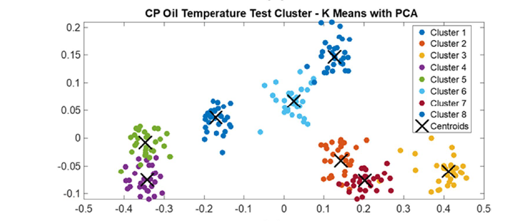
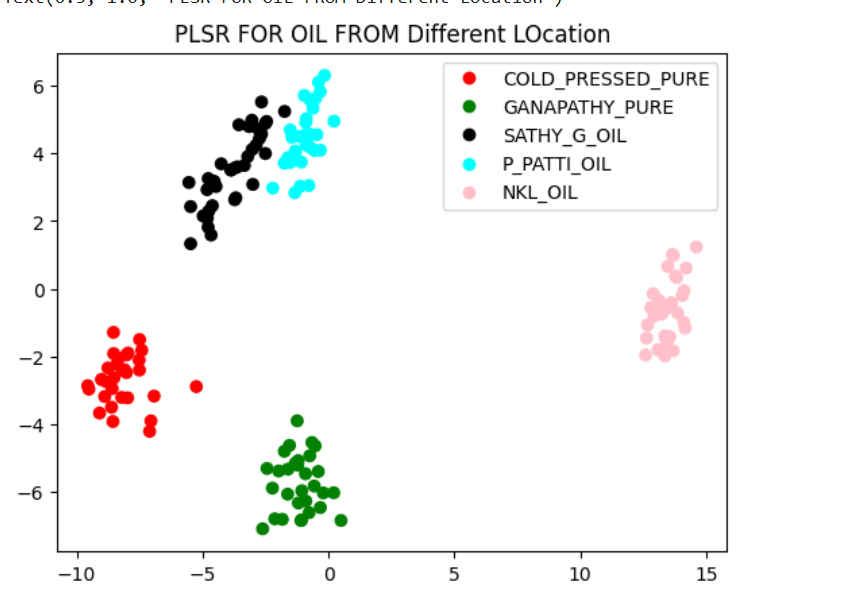
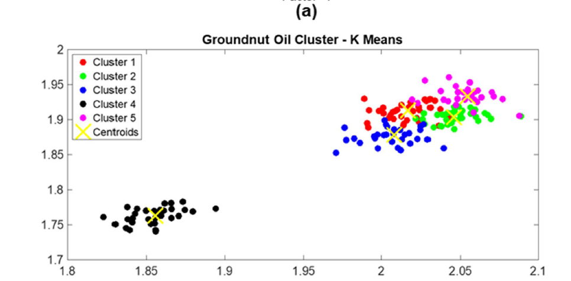

# Classification of Groundnut Oil Using ATR‑MIR Spectroscopy and Chemometrics

**Published**: Food Analytical Methods (Mar 8, 2022)  
**DOI**: [10.1007/s12161-022-02230-5](https://doi.org/10.1007/s12161-022-02230-5)

---

## 📝 Abstract
This study explores the use of Attenuated Total Reflectance Mid-Infrared (ATR‑MIR) spectroscopy combined with chemometric methods to classify groundnut (peanut) oils—specifically cold-pressed (CP) versus various hot‑pressed/refined brands (HP). Spectral changes under heating conditions (50–200 °C) were analyzed to understand oxidation patterns. Partial Least Squares Regression (PLSR) and K-means clustering/PCA achieved a calibration model with R² = 0.999 and RMSECV = 0.285–0.373.

---

## 🎯 Problem Statement
Groundnut oil has significant dietary and commercial importance. Accurate classification (cold-pressed vs. hot-pressed brands) and monitoring of oxidation due to heating is critical for quality control and adulteration detection.

---

## 📊 Dataset
- Samples included **cold-pressed groundnut oil** and **three commercial hot-pressed/refined brands**.
- Oil samples were heated at **50, 75, 100, 125, 150, 175, and 200 °C** to study thermal effects.

---

## 🔬 Methodology

### 1. **Spectroscopy**  
- ATR‑MIR spectra recorded in the mid‑infrared range (5–11 µm; ~2000–909 cm⁻¹).

### 2. **Chemometric Analysis**  
- **PLSR**: built quantitative calibration models for classifying oil types.  
- **K-means clustering**: used on derivative spectra to group based on oil type and heating level.  
- **PCA**: visualized clusters and interpreted variance among samples.

---

## 🧠 Model Architecture
- **Input features**: MIR spectral intensities at multiple wavenumbers.
- **PLSR**: supervised learning for regression/classification with cross-validation.
- **K-means & PCA**: unsupervised learning for clustering and dimensionality reduction.

---

## 📐 Evaluation Metrics
- **R² (coefficient of determination)**: 0.999 – indicates excellent model fit.
- **RMSECV (Root Mean Square Error of Cross Validation)**: 0.285–0.373 – indicates low error.

---

## 🎯 Results
- Accurate classification between cold-pressed and hot-pressed oils.
- Oxidation effects captured through spectral variation at increasing temperatures.
- Visual clustering validated the distinct thermal behavior of oil types.

---
### 📊 Visualizations

#### 1. PCA Clustering of Oil Types

#### 2. PLSR Clustering

#### 2. K means  Clustering

## 📚 References
- [DOI: 10.1007/s12161-022-02230-5](https://doi.org/10.1007/s12161-022-02230-5)
